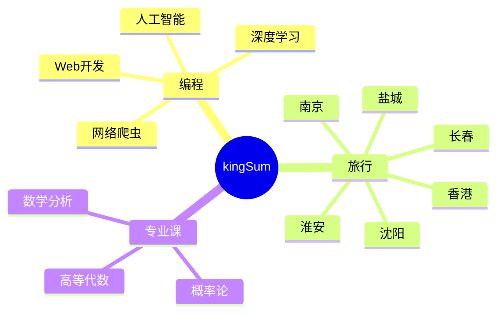

  
  <!-- dynamic typing effect 动态打字效果 -->
  

    
  

  <!-- knock code pictures 敲代码的图片 -->
   

  <!-- profile logo 个人资料徽标 -->
  

    &emsp;
    &emsp;
    &emsp;
    &emsp;
    &emsp;
    <!-- visitor statistics logo 访问量统计徽标 -->
    
  

<!-- Snake Code Contribution Map 贪吃蛇代码贡献图 -->
<picture>
  <source media="(prefers-color-scheme: dark)" srcset="https://cdn.jsdelivr.net/gh/zjt666666zjt/zjt666666zjt/profile-snake-contrib/github-contribution-grid-snake-dark.svg" />
  <source media="(prefers-color-scheme: light)" srcset="https://cdn.jsdelivr.net/gh/zjt666666zjt/zjt666666zjt/profile-snake-contrib/github-contribution-grid-snake.svg" />
  
</picture>

#  🙋 Hello

<table>
<tr><td>

<!-- About me 关于我 -->
### 🤺 About Me

&emsp;&emsp;Hello , my name is KingSum.

&emsp;&emsp;Currently a sophomore, majoring in applied statistics, focusing on machine learning and professional course knowledge.

&emsp;&emsp;Love programming, photography, traveling, and reading.

&emsp;&emsp;I love computer science and IT Internet career, and am inspired to become an excellent developer.

<strong>&emsp;&emsp;Let's build from here.</strong>

<!--START_SECTION:waka-->

 Last Updated on 20/10/2023 01:12:42 UTC
<!--END_SECTION:waka-->
  
</td></tr>
</table>

<!-- ########################################## 分割 ########################################## -->

<!-- just img 图片 -->

<!--  skill badge 技能徽章 -->
💪 正在学习

  
🧠 计划学习

🧰 常用的工具

<!-- programming tool icon 编程工具图标 -->
 

<!-- svg -->

 

 

<!-- gif -->

<!-- just img 图片 -->

<!-- ########################################## 分割 ########################################## -->

  
<!-- Quotes 名人名言 -->
 
  
<!-- GitHub 奖杯🏆 -->
 

<!-- GitHub 数据统计 -->

  

  

  
  </tr>
</table>

<!-- ########################################## 分割 ########################################## -->

<!-- run 图片 -->

<!-- Joke 笑话 -->

<!-- github-readme-streak-stats 连续提交代码天数记录 -->
&emsp;

&emsp;

